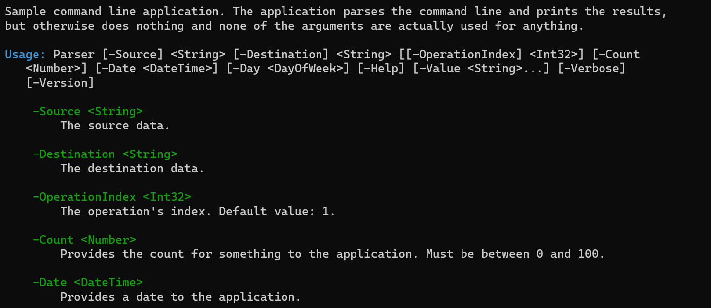

# Generating usage help

When you have an application that accepts command line arguments, you'll want to be able to show a
help message to the user, indicating all the possible command line arguments.

Creating this kind of usage help text is tedious, and you must make sure it is kept up to date
whenever you change the arguments to your application. Ookii.CommandLine generates this usage help
text automatically, alleviating this problem.

If you use the generated [`Parse()`][Parse()_7] method (with [source generation](SourceGeneration.md)), the
static [`CommandLineParser.Parse<T>()`][] method, or the
[`CommandLineParser<T>.ParseWithErrorHandling()`][] method, usage help will be printed automatically
in the event the command line is invalid, or the `-Help` argument was used. You can customize the
format using the [`ParseOptions.UsageWriter`][] property.

If you don't use those methods, you can generate the usage help using the
[`CommandLineParser.WriteUsage()`][] method. By default, the [`CommandLineParser.WriteUsage()`][]
method will write the usage help to the standard output stream, using the
[`LineWrappingTextWriter`][] class to white-space wrap the text at the console width.

You can also get a string with the usage help using the [`CommandLineParser.GetUsage()`][] method.

The following example shows the usage help generated for the [parser sample](../src/Samples/Parser)
application included with the Ookii.CommandLine library:

```text
Sample command line application. The application parses the command line and prints the results,
but otherwise does nothing and none of the arguments are actually used for anything.

Usage: Parser [-Source] <String> [-Destination] <String> [[-OperationIndex] <Int32>] [-Count
   <Number>] [-Date <DateTime>] [-Day <DayOfWeek>] [-Help] [-Value <String>...] [-Verbose]
   [-Version]

    -Source <String>
        The source data.

    -Destination <String>
        The destination data.

    -OperationIndex <Int32>
        The operation's index. Default value: 1.

    -Count <Number>
        Provides the count for something to the application. Must be between 0 and 100.

    -Date <DateTime>
        Provides a date to the application.

    -Day <DayOfWeek>
        This is an argument using an enumeration type. Possible values: Sunday, Monday, Tuesday,
        Wednesday, Thursday, Friday, Saturday.

    -Help [<Boolean>] (-?, -h)
        Displays this help message.

    -Value <String>
        This is an example of a multi-value argument, which can be repeated multiple times to set
        more than one value.

    -Verbose [<Boolean>] (-v)
        Print verbose information; this is an example of a switch argument.

    -Version [<Boolean>]
        Displays version information.
```

The usage help consists of four main components: the application description, the argument syntax,
the argument descriptions, and an optional footer.

## Application description

The first part of the usage help is a description of your application. This is a short description
that explains what your application does and how it can be used. It can be any text you like, though
it’s recommended to keep it short.

The description is specified by using the [`System.ComponentModel.DescriptionAttribute`][] on the class
that defines the command line arguments, as in the following example:

```csharp
[GeneratedParser]
[Description("This is the application description that is included in the usage help.")]
partial class MyArguments
{
}
```

If this attribute is not specified, no description is included in the usage help. The description
can also be omitted by setting the [`UsageWriter.IncludeApplicationDescription`][] property to
false.

If you are using [subcommands](Subcommands.md), this first line is the command description, which
is specified the same way, by applying the [`DescriptionAttribute`][] to your command class.

## Argument syntax

The argument syntax shows the arguments and their types, telling the user in short how your
application can be invoked from the command line. The argument syntax typically starts with the name
of the application executable, and is followed by all the arguments, indicating their name and type.
The syntax shows which arguments are required or optional, positional, and whether they allow
multiple values.

The order of the arguments in the usage syntax is as follows:

1. The positional arguments, in their defined order.
2. Required non-positional arguments, in alphabetical order.
3. The remaining arguments, in alphabetical order.

The syntax for a single argument has the following default format:

1. For a required, non-positional argument:

    ```text
    -ArgumentName <ValueDescription>
    ```

2. For an optional, non-positional argument:

    ```text
    [-ArgumentName <ValueDescription>]
    ```

3. For a required, positional argument:

    ```text
    [-ArgumentName] <ValueDescription>
    ```

4. For an optional, positional argument:

    ```text
    [[-ArgumentName] <ValueDescription>]
    ```

5. For a switch argument:

    ```text
    [-ArgumentName]
    ```

6. For a multi-value or dictionary argument (which can be combined with the other formatting
   options):

    ```text
    -ArgumentName <ValueDescription>...
    ```

Essentially, anything that's optional is enclosed in square brackets, switch arguments have their
value description (the argument type) omitted, and multi-value arguments are followed by an ellipsis.
This is the default formatting; it can be [customized](#customizing-the-usage-help).

If your application has a lot of arguments, the usage syntax may become very long, and therefore
hard to read. Set the [`UsageWriter.UseAbbreviatedSyntax`][] property to omit all but the
positional arguments; the user can instead use the argument description list to see what arguments
are available.

If you are using [long/short mode](Arguments.md#longshort-mode), you can set the
[`UsageWriter.UseShortNamesForSyntax`][] property to use short arguments names instead of long
names, for arguments that have a short name, in the usage syntax.

### Value descriptions

Arguments are followed by a short description of the type of value they support, in angle brackets.
This is called the _value description_. It's a short, typically one-word description that describes
the kind of value the argument expects. It should _not_ be used for the longer description of the
argument's purpose.

The value description defaults to the type of the argument (e.g. [`Int32`][] or [`String`][]), stripping off
any namespace prefixes. For multi-value arguments the element type is used, and for arguments using
[`Nullable<T>`][], the name of the type `T` is used. For dictionary arguments, the default is
`TKey=TValue`.

To specify a different value description for an argument, use the [`ValueDescriptionAttribute`][].

```csharp
[CommandLineArgument]
[ValueDescription("Number")]
public int Argument { get; set; }
```

This will cause the argument's syntax to show `-Argument <Number>` instead of `-Argument <Int32>`.

You can also provide a custom default value description for a particular type by using the
[`ParseOptions.DefaultValueDescriptions`][] property:

```csharp
var options = new ParseOptions()
{
    DefaultValueDescriptions = new Dictionary<Type, string>()
    {
        { typeof(int), "Number" }
    },
}
```

Now, all arguments of type [`Int32`][] will use "Number" as the value description.

Switch arguments don't have a value description in the argument syntax, though they do in the
argument description list by default.

## Argument descriptions

After the usage syntax, the usage help ends with a list of all arguments with their detailed
descriptions.

The description of an argument can be specified using the [`DescriptionAttribute`][] attribute.
Apply this attribute to the property or method defining the argument. It's strongly recommended to
add a description to every argument.

```csharp
[CommandLineArgument]
[Description("Provides a value to the application")]
public int Argument { get; set; }
```

By default, the list of argument descriptions will include any argument aliases, their default
values if set, and any [validator messages](Validation.md). This can be customized using the
[`UsageWriter`][] class.

You can choose which arguments are included in the description list using the
[`UsageWriter.ArgumentDescriptionListFilter`][] property. By default, this is set to
[`DescriptionListFilterMode.Information`][], which means that any argument that has any information
that isn't part of the usage syntax will be included. This could be a description, aliases, a
default value, or at least one validator message. You can choose to include only arguments with
descriptions (this was the default behavior before version 3.0), all arguments, or to omit the
description list entirely.

You can also choose the sort order of the description list using the
[`UsageWriter.ArgumentDescriptionListOrder`][] property. This defaults to the same order as the
usage syntax, but you can also choose to sort by ascending or descending long or short name.

The generated [`Parse()`][Parse()_7] method, the static [`CommandLineParser.Parse<T>()`][] method and the
[`CommandLineParser<T>.ParseWithErrorHandling()`][] method method will show usage help on error, but
by default they will show only the usage syntax, and a message telling the user to get more help
with the `-Help` argument. This makes sure the error message is obvious even if you have a lot of
arguments.

You can use the [`ParseOptions.ShowUsageOnError`][] property to customize this behavior.

### Default values

An argument's default value will be included in the usage help if the
[`UsageWriter.IncludeDefaultValueInDescription`][] property is true and the
[`CommandLineArgumentAttribute.IncludeDefaultInUsageHelp`][] property is true. Both of these are
true by default, but they can be set to false to disable including the default value either globally
or for a specific argument.

If you use [source generation](SourceGeneration.md) with the [`GeneratedParserAttribute`][]
attribute, you can use a property initializer to set a default value which will be shown in the
description. Without source generation, only default values set using the
[`CommandLineArgumentAttribute.DefaultValue`][] property can be shown.

You can customize how an argument's default value is formatted in the usage help by using the
[`CommandLineArgumentAttribute.DefaultValueFormat`][] property. This property takes a compound
formatting string with a single placeholder. For example, the following argument displays its
default value in hexadecimal, as `0xff`:

```csharp
[GeneratedParser]
partial class MyArguments
{
    [CommandLineArgument(DefaultValueFormat = "0x{0:x}")]
    public int Argument { get; set; } = 0xff;
}
```

Without the custom format, the value would've been formatted as `255`.

### Descriptions with blank lines

Sometimes, you may want to make your argument description more legible by including blank lines.
Unfortunately, this does not work well with the default usage help format, because the descriptions
are indented, but indentation is reset after a blank line. This means your usage help can end up
looking like this:

```text
    -SomeArgument <String>
        First line of the description.

And another line, after a blank line.

    -OtherArgument <Int32>
        Other description.
```

To avoid this, set the [`UsageWriter.IndentAfterEmptyLine`][] property to true. Now, the same usage
help will look like this:

```text
    -SomeArgument <String>
        First line of the description.

        And another line, after a blank line.

    -OtherArgument <Int32>
        Other description.
```

### Argument categories

If you have an application with a large number of command line arguments, it can get hard to find
specific functionality in the usage help. In that case, you may want to organize your usage help by
grouping arguments into categories.

To do this, you must create an enumeration that defines the possible categories. For example:

```csharp
enum ArgumentCategory
{
    [Description("The first category")]
    First,
    [Description("The second category")]
    Second,
    [Description("Other options")]
    Other
}
```

You can use any enumeration type, and you can define as many categories as you like, with whatever
names you like. The numerical values of the enumeration members determine the order of the
categories in the help text.

Apply the `DescriptionAttribute` to each member in the enumeration to set the text that will be used
for the category header. If the `DescriptionAttribute` is not present, the name of the enumeration
member will be used instead.

To set the category for an argument, use the `CommandLineArgumentAttribute.Category` property.

```csharp
[GeneratedParser]
partial class MyArguments
{
    [CommandLineArgument(Category = ArgumentCategory.First)]
    [Description("Some argument in the first category.")]
    public int Argument { get; set; }

    [CommandLineArgument(Category = ArgumentCategory.Second)]
    [Description("An argument in the second category.")]
    public string SecondCategoryArgument { get; set; }

    [CommandLineArgument(Category = ArgumentCategory.Second)]
    [Description("Another argument in the second category.")]
    public string OtherSecondCategoryArgument { get; set; }

    [CommandLineArgument(Category = ArgumentCategory.Other)]
    [Description("An argument in the other category.")]
    public bool OtherArgument { get; set; }
}
```

> [!NOTE]
> The `CommandLineArgumentAttribute.Category` property has the type `object`, but it must be an
> enumeration value. This was done because the type `Enum` is not allowed for use with attributes.

The descriptions for these arguments would look like this:

```text
The first category

    -Argument <Int32>
        Some argument in the first category.

The second category

    -OtherSecondCategoryArgument <String>
        Another argument in the second category.

    -SecondCategoryArgument <String>
        An argument in the second category.

Other options

    -OtherArgument <Boolean>
        An argument in the other category.
```

Arguments in the same category will be grouped together, even if their properties or methods were
not together in the arguments class. The arguments inside each category are sorted using the usual
rules (positional arguments first, then named required, then optional, in alphabetical order by
default).

Arguments that have no category specified, as well as the automatic help and version arguments, will
be shown above any arguments that do have a category. If you wish to include these arguments in a
category, you can use the `ParseOptionsAttribute.DefaultCategory` property:

```csharp
[GeneratedParser]
[ParseOption(DefaultCategory = ArgumentCategory.Other)]
partial class MyArguments
{
}
```

This applies both to manually defined arguments with no explicit category, and the automatic help
and version arguments, if they are present.

> [!NOTE]
> All arguments in a class, including those using the default category, must use the same
> enumeration type for their category. This also includes any arguments defined in a base class.

For a more complete example of arguments using categories, check out the
[categories sample](../src/Samples/Categories).

## Hidden arguments

Sometimes, you may want an argument to be available, but not easily discoverable. For example, if
an argument is deprecated, or part of preview functionality. For this purpose, you can hide an
argument, which means that it can still be used, but won't be included in the usage syntax or
argument description list.

To hide an argument, use the [`CommandLineArgumentAttribute.IsHidden`][] property.

```csharp
[CommandLineArgument(IsHidden = true)]
public int Argument { get; set; }
```

Note that positional and required arguments cannot be hidden.

## Usage help footer

The application description is shown at the top of the usage help, but sometimes you may want to
add additional information at the bottom, for example to direct the user how to get additional
help.

To add additional text below the argument descriptions, you can use the [`UsageFooterAttribute`][]
attribute. Apply this attribute to your command line arguments class to set a footer.

```csharp
[GeneratedParser]
[Description("This is the application description.")]
[UsageFooter("For more information, see https://www.example.com")]
partial class Arguments
{
}
```

## Color output

When possible, Ookii.CommandLine will use color when writing usage help. This is controlled by the
[`UsageWriter.UseColor`][] property. When set to null (the default), the [`UsageWriter`][] tries to
determine whether color is supported. Color will only be enabled if:

1. There is no environment variable named `NO_COLOR`.
2. The standard output stream is not redirected.
3. The `TERM` environment variable is not set to `dumb`.
4. On Windows, enabling virtual terminal sequences using [`SetConsoleMode`][] must succeed.
5. On other platforms, the `TERM` environment variable must be defined.

[`UsageWriter`][] uses virtual terminal sequences to set color. Several components of the help have
preset colors, which can be customized using properties of the [`UsageWriter`][] class. Set them to any
of the constants of the [`TextFormat`][] class, or the return value of the [`GetExtendedColor()`][] method
for any 24-bit color.

In order to support proper white-space wrapping for text that contains virtual terminal sequences,
the [`LineWrappingTextWriter`][] class will not count virtual terminal sequences as part of the line
length.

The below is an example of the usage help with the default colors.



## Customizing the usage help

The usage help can be heavily customized. We've already seen how it can be customized using things
such as custom value descriptions, or various properties of the [`UsageWriter`][] class. These can
also be used to control the indentation of the text, what elements to include, and various small
formatting changes such as whether to use white space or the custom separator between argument names
and values.

To customize the usage even further, you can derive a class from the [`UsageWriter`][] class. The
[`UsageWriter`][] class has protected virtual methods for every part of the usage. These range from
top-level methods like [`WriteParserUsageCore()`][] which drives the entire process, methods responsible
for a section such as [`WriteParserUsageSyntax()`][] or [`WriteArgumentDescriptions()`][], methods
responsible for a single argument like [`WriteArgumentSyntax()`][] or [`WriteArgumentDescription()`][WriteArgumentDescription()_1], down
to methods that write single piece of text like [`WriteArgumentName()`][] or [`WriteValueDescription()`][].

> [!NOTE]
> The [`UsageWriter`][] class has several properties and methods that apply only to
> [subcommands](Subcommands.md#subcommand-usage-help), so setting or overriding these will have no
> effect if you are not using subcommands.

These methods call each other, so you can customize as little or as much as you like, depending on
which methods you override. For example, if you want to use something other than angle brackets for
value descriptions, just override [`WriteValueDescription()`][] (and probably also
[`WriteValueDescriptionForDescription()`][]). Or, if you want to change the entire format of the
descriptions, override [`WriteArgumentDescription()`][WriteArgumentDescription()_1].

To specify a custom usage writer, assign it to the [`ParseOptions.UsageWriter`][] property.

The [custom usage sample](../src/Samples/CustomUsage) uses a custom usage writer, as well as a
custom [`LocalizedStringProvider`][], to radically alter the format of the usage help, as seen below.

```text
DESCRIPTION:
  Sample command line application with highly customized usage help. The application parses the
  command line and prints the results, but otherwise does nothing and none of the arguments are
  actually used for anything.

USAGE:
  CustomUsage [--source] <string> [--destination] <string> [arguments]

OPTIONS:
  -c|--count <number>         Provides the count for something to the application. [range: 0-100]
  -d|--destination <string>   The destination data.
  -D|--date <date-time>       Provides a date to the application.
  --day <day-of-week>         This is an argument using an enumeration type. Possible values:
                              Sunday, Monday, Tuesday, Wednesday, Thursday, Friday, Saturday.
  -h|--help                   Displays this help message.
  --operation-index <number>  The operation's index. [default: 1]
  -p|--process                Does the processing.
  -s|--source <string>        The source data.
  -v|--verbose                Print verbose information; this is an example of a switch argument.
  --value <string>            This is an example of a multi-value argument, which can be repeated
                              multiple times to set more than one value.
  --version                   Displays version information.
```

The [WPF usage sample](../src/Samples/Wpf) is another example that uses a custom [`UsageWriter`][], in
this case to format the usage help as HTML.

You can see that the [`UsageWriter`][] class offers a lot of flexibility to customize the usage help
to your liking.

## Subcommand usage help

Please see the [subcommand documentation](Subcommands.md) for information about their usage help.

Next, we'll take a look at [argument validation and dependencies](Validation.md).

[`CommandLineArgumentAttribute.DefaultValue`]: https://www.ookii.org/docs/commandline-5.0/html/P_Ookii_CommandLine_CommandLineArgumentAttribute_DefaultValue.htm
[`CommandLineArgumentAttribute.DefaultValueFormat`]: https://www.ookii.org/docs/commandline-5.0/html/P_Ookii_CommandLine_CommandLineArgumentAttribute_DefaultValueFormat.htm
[`CommandLineArgumentAttribute.IncludeDefaultInUsageHelp`]: https://www.ookii.org/docs/commandline-5.0/html/P_Ookii_CommandLine_CommandLineArgumentAttribute_IncludeDefaultInUsageHelp.htm
[`CommandLineArgumentAttribute.IsHidden`]: https://www.ookii.org/docs/commandline-5.0/html/P_Ookii_CommandLine_CommandLineArgumentAttribute_IsHidden.htm
[`CommandLineParser.GetUsage()`]: https://www.ookii.org/docs/commandline-5.0/html/M_Ookii_CommandLine_CommandLineParser_GetUsage.htm
[`CommandLineParser.Parse<T>()`]: https://www.ookii.org/docs/commandline-5.0/html/M_Ookii_CommandLine_CommandLineParser_Parse__1.htm
[`CommandLineParser.WriteUsage()`]: https://www.ookii.org/docs/commandline-5.0/html/M_Ookii_CommandLine_CommandLineParser_WriteUsage.htm
[`CommandLineParser<T>.ParseWithErrorHandling()`]: https://www.ookii.org/docs/commandline-5.0/html/M_Ookii_CommandLine_CommandLineParser_1_ParseWithErrorHandling.htm
[`DescriptionAttribute`]: https://learn.microsoft.com/dotnet/api/system.componentmodel.descriptionattribute
[`DescriptionListFilterMode.Information`]: https://www.ookii.org/docs/commandline-5.0/html/T_Ookii_CommandLine_DescriptionListFilterMode.htm
[`GeneratedParserAttribute`]: https://www.ookii.org/docs/commandline-5.0/html/T_Ookii_CommandLine_GeneratedParserAttribute.htm
[`GetExtendedColor()`]: https://www.ookii.org/docs/commandline-5.0/html/M_Ookii_CommandLine_Terminal_TextFormat_GetExtendedColor.htm
[`Int32`]: https://learn.microsoft.com/dotnet/api/system.int32
[`LineWrappingTextWriter`]: https://www.ookii.org/docs/commandline-5.0/html/T_Ookii_CommandLine_LineWrappingTextWriter.htm
[`LocalizedStringProvider`]: https://www.ookii.org/docs/commandline-5.0/html/T_Ookii_CommandLine_LocalizedStringProvider.htm
[`Nullable<T>`]: https://learn.microsoft.com/dotnet/api/system.nullable-1
[`ParseOptions.DefaultValueDescriptions`]: https://www.ookii.org/docs/commandline-5.0/html/P_Ookii_CommandLine_ParseOptions_DefaultValueDescriptions.htm
[`ParseOptions.ShowUsageOnError`]: https://www.ookii.org/docs/commandline-5.0/html/P_Ookii_CommandLine_ParseOptions_ShowUsageOnError.htm
[`ParseOptions.UsageWriter`]: https://www.ookii.org/docs/commandline-5.0/html/P_Ookii_CommandLine_ParseOptions_UsageWriter.htm
[`SetConsoleMode`]: https://learn.microsoft.com/windows/console/setconsolemode
[`String`]: https://learn.microsoft.com/dotnet/api/system.string
[`System.ComponentModel.DescriptionAttribute`]: https://learn.microsoft.com/dotnet/api/system.componentmodel.descriptionattribute
[`TextFormat`]: https://www.ookii.org/docs/commandline-5.0/html/T_Ookii_CommandLine_Terminal_TextFormat.htm
[`UsageFooterAttribute`]: https://www.ookii.org/docs/commandline-5.0/html/T_Ookii_CommandLine_UsageFooterAttribute.htm
[`UsageWriter.ArgumentDescriptionListFilter`]: https://www.ookii.org/docs/commandline-5.0/html/P_Ookii_CommandLine_UsageWriter_ArgumentDescriptionListFilter.htm
[`UsageWriter.ArgumentDescriptionListOrder`]: https://www.ookii.org/docs/commandline-5.0/html/P_Ookii_CommandLine_UsageWriter_ArgumentDescriptionListOrder.htm
[`UsageWriter.IncludeApplicationDescription`]: https://www.ookii.org/docs/commandline-5.0/html/P_Ookii_CommandLine_UsageWriter_IncludeApplicationDescription.htm
[`UsageWriter.IncludeDefaultValueInDescription`]: https://www.ookii.org/docs/commandline-5.0/html/P_Ookii_CommandLine_UsageWriter_IncludeDefaultValueInDescription.htm
[`UsageWriter.IndentAfterEmptyLine`]: https://www.ookii.org/docs/commandline-5.0/html/P_Ookii_CommandLine_UsageWriter_IndentAfterEmptyLine.htm
[`UsageWriter.UseAbbreviatedSyntax`]: https://www.ookii.org/docs/commandline-5.0/html/P_Ookii_CommandLine_UsageWriter_UseAbbreviatedSyntax.htm
[`UsageWriter.UseColor`]: https://www.ookii.org/docs/commandline-5.0/html/P_Ookii_CommandLine_UsageWriter_UseColor.htm
[`UsageWriter.UseShortNamesForSyntax`]: https://www.ookii.org/docs/commandline-5.0/html/P_Ookii_CommandLine_UsageWriter_UseShortNamesForSyntax.htm
[`UsageWriter`]: https://www.ookii.org/docs/commandline-5.0/html/T_Ookii_CommandLine_UsageWriter.htm
[`ValueDescriptionAttribute`]: https://www.ookii.org/docs/commandline-5.0/html/T_Ookii_CommandLine_ValueDescriptionAttribute.htm
[`WriteArgumentDescriptions()`]: https://www.ookii.org/docs/commandline-5.0/html/M_Ookii_CommandLine_UsageWriter_WriteArgumentDescriptions.htm
[`WriteArgumentName()`]: https://www.ookii.org/docs/commandline-5.0/html/M_Ookii_CommandLine_UsageWriter_WriteArgumentName.htm
[`WriteArgumentSyntax()`]: https://www.ookii.org/docs/commandline-5.0/html/M_Ookii_CommandLine_UsageWriter_WriteArgumentSyntax.htm
[`WriteParserUsageCore()`]: https://www.ookii.org/docs/commandline-5.0/html/M_Ookii_CommandLine_UsageWriter_WriteParserUsageCore.htm
[`WriteParserUsageSyntax()`]: https://www.ookii.org/docs/commandline-5.0/html/M_Ookii_CommandLine_UsageWriter_WriteParserUsageSyntax.htm
[`WriteValueDescription()`]: https://www.ookii.org/docs/commandline-5.0/html/M_Ookii_CommandLine_UsageWriter_WriteValueDescription.htm
[`WriteValueDescriptionForDescription()`]: https://www.ookii.org/docs/commandline-5.0/html/M_Ookii_CommandLine_UsageWriter_WriteValueDescriptionForDescription.htm
[Parse()_7]: https://www.ookii.org/docs/commandline-5.0/html/Overload_Ookii_CommandLine_IParser_1_Parse.htm
[WriteArgumentDescription()_1]: https://www.ookii.org/docs/commandline-5.0/html/M_Ookii_CommandLine_UsageWriter_WriteArgumentDescription.htm
