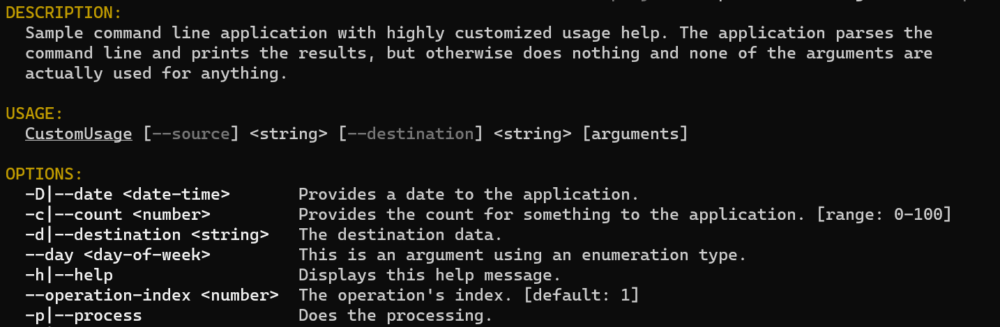

# Custom usage sample

This sample shows the flexibility of Ookii.CommandLine's usage help generation. It uses a custom
[`UsageWriter`][], along with a custom [`LocalizedStringProvider`][], to completely transform the way
the usage help looks.

This sample also uses long/short parsing mode, but everything in it is applicable to default mode as
well.

It uses the same arguments as the [long/short mode sample](../LongShort), so see that for more
details about each argument.

The usage help for this sample looks very different:

```text
DESCRIPTION:
  Sample command line application with highly customized usage help. The application parses the
  command line and prints the results, but otherwise does nothing and none of the arguments are
  actually used for anything.

USAGE:
  CustomUsage [--source] <string> [--destination] <string> [arguments]

OPTIONS:
  -c|--count <number>         Provides the count for something to the application. [range: 0-100]
  -d|--destination <string>   The destination data.
  -D|--date <date-time>       Provides a date to the application.
  --day <day-of-week>         This is an argument using an enumeration type. Possible values:
                              Sunday, Monday, Tuesday, Wednesday, Thursday, Friday, Saturday.
  -h|--help                   Displays this help message.
  --operation-index <number>  The operation's index. [default: 1]
  -p|--process                Does the processing.
  -s|--source <string>        The source data.
  -v|--verbose                Print verbose information; this is an example of a switch argument.
  --value <string>            This is an example of a multi-value argument, which can be repeated
                              multiple times to set more than one value.
  --version                   Displays version information.
```

Customizing the usage help like this is not difficult, thanks to the [`UsageWriter`][] class. The
sample [derives a class from it](CustomUsageWriter.cs), and overrides several methods to customize
the format. This allows it to change the parts it wants, and reuse the code for the parts that are
not different.

The sample also customizes the colors of the output, as shown in the below screenshot:



If you compare this with the usage output of the [parser sample](../Parser), which uses the default
output format, you can see just how much you can change by simply overriding some methods on the
[`UsageWriter`][] class.

[`LocalizedStringProvider`]: https://www.ookii.org/docs/commandline-4.0/html/T_Ookii_CommandLine_LocalizedStringProvider.htm
[`UsageWriter`]: https://www.ookii.org/docs/commandline-4.0/html/T_Ookii_CommandLine_UsageWriter.htm
