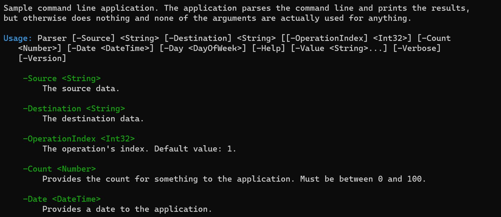

# Parser sample

This sample shows the basic functionality of Ookii.CommandLine. It shows you have to define a number
of arguments with different types and options, and how to easily parse them. It then prints the value
of the supplied arguments.

The sample contains detailed information about every step it takes, so it should be a good learning
resource to get started. Check [ProgramArguments.cs](ProgramArguments.cs) for the details, and
[Program.cs](Program.cs) for the main function.

This sample prints the following usage help, when invoked with the "-Help" argument:

```text
Sample command line application. The application parses the command line and prints the results,
but otherwise does nothing and none of the arguments are actually used for anything.

Usage: Parser [-Source] <String> [-Destination] <String> [[-OperationIndex] <Int32>] [-Count
   <Number>] [-Date <DateTime>] [-Day <DayOfWeek>] [-Help] [-Value <String>...] [-Verbose]
   [-Version]

    -Source <String>
        The source data.

    -Destination <String>
        The destination data.

    -OperationIndex <Int32>
        The operation's index. Default value: 1.

    -Count <Number>
        Provides the count for something to the application. Must be between 0 and 100.

    -Date <DateTime>
        Provides a date to the application.

    -Day <DayOfWeek>
        This is an argument using an enumeration type.

    -Help [<Boolean>] (-?, -h)
        Displays this help message.

    -Value <String>
        This is an example of a multi-value argument, which can be repeated multiple times to set
        more than one value.

    -Verbose [<Boolean>] (-v)
        Print verbose information; this is an example of a switch argument.

    -Version [<Boolean>]
        Displays version information.
```

This is the default usage help format used by Ookii.CommandLine, with no modifications.

You can see, for example, how the text is neatly white-space wrapped and indented, how the -Count
argument's custom value description is used, how the -OperationIndex argument shows the default
value, how the -Count argument shows a message from its ValidateRange validator, and how the aliases
of the -Verbose and -Help arguments are shown.

If the console is capable, color output is used, as shown below (the colors are fully customizable).



If you run the sample without arguments, it instead shows this:

```text
The required argument 'Source' was not supplied.

Usage: Parser [-Source] <String> [-Destination] <String> [[-OperationIndex] <Int32>] [-Count
   <Number>] [-Date <DateTime>] [-Day <DayOfWeek>] [-Help] [-Value <String>...] [-Verbose]
   [-Version]

Run 'Parser -Help' for more information.
```

Here, it only shows the usage syntax and a message indicating how to get more help. This is because
the sample uses `ShowUsageOnError = UsageHelpRequest.SyntaxOnly` in the `ParseOptions`.

You can also use the automatic -Version argument:

```text
Ookii.CommandLine Sample 3.0.0
Copyright (c) Sven Groot (Ookii.org)
This is sample code, so you can use it freely.
```

The -Version argument shows the value of the ApplicationFriendlyNameAttribute (or the assembly
name if there isn't one), the assembly informational version, and the assembly's copyright.
