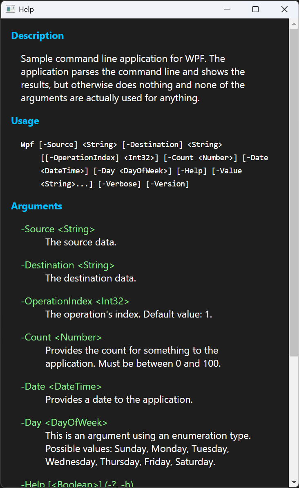

# WPF sample

This sample demonstrates how you can use Ookii.CommandLine in an application with a graphical user
interface. It uses the same arguments as the [parser sample](../Parser).

Running this sample requires Microsoft Windows.

This sample does not use the static [`CommandLineParser.Parse<T>()`][] method, but instead handles
errors manually so it can show a dialog with the error message and a help button, and show the
usage help only if that button was clicked, or the `-Help` argument was used.

To use as much of the built-in usage help generation as possible, this sample uses a class derived
from the [`UsageWriter`][] class (see [HtmlUsageWriter.cs](HtmlUsageWriter.cs)) that wraps the
various components of the help in an HTML page, and then displays that to the user using a
[WebView2 control](https://learn.microsoft.com/microsoft-edge/webview2/).

The sample uses a simple CSS stylesheet to format the usage help; you can make this as fancy as you
like, of course.

This is by no means the only way. Since all the information needed to generate usage help is
available in the [`CommandLineParser<T>`][] class, you could for example use a custom XAML page to show
the usage help.

This sample also defines a custom `-Version` argument; the automatic one that gets added by
Ookii.CommandLine writes to the console, so it isn't useful here. This manual implementation shows
the same version information in a dialog box.

A similar approach would work for Windows Forms, or any other GUI framework.

This application is very basic; it's just a sample, and I don't do a lot of GUI work nowadays. It's
just intended to show how the [`UsageWriter`][] can be adapted to work in the context of a GUI app.

[`CommandLineParser.Parse<T>()`]: https://www.ookii.org/docs/commandline-3.0-preview/html/M_Ookii_CommandLine_CommandLineParser_Parse__1.htm
[`CommandLineParser<T>`]: https://www.ookii.org/docs/commandline-3.0-preview/html/T_Ookii_CommandLine_CommandLineParser_1.htm
[`UsageWriter`]: https://www.ookii.org/docs/commandline-3.0-preview/html/T_Ookii_CommandLine_UsageWriter.htm
